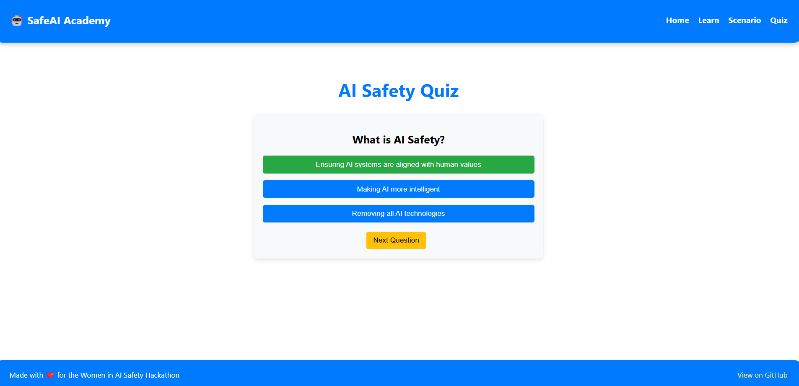

# SafeAI Academy

🚀 **Hackathon Project: Women in AI Safety Hackathon**

## 🌟 Project Overview

SafeAI Academy is an interactive learning platform designed to educate users about **AI Safety** through **scenarios and quizzes**. My goal is to raise awareness about AI risks, biases, and ethical decision-making.

## 🎯 Key Features

* **Interactive Learning:** Users explore AI safety topics through real-world scenarios.
* **AI Safety Quiz:** Engage with a quiz to test knowledge on AI ethics and safety.
* **User-Friendly Interface:** Clean and responsive UI for seamless experience.
* **Fully Responsive Design:** Optimized for mobile and desktop.
* **GitHub Pages Deployment:** Hosted live for public access.

## 🔗 Live Demo

[**🚀 View Project Here**]()

## 🛠️ Tech Stack

### **Frontend Technologies**

* **React.js** → The core framework used for building a dynamic and efficient UI.
* **React Router** → Enables smooth navigation between different pages without full-page reloads.
* **JSON (Static Data)** → Used for storing quiz and scenario questions, making the app flexible and easily extendable.

### **Styling & UI**

* **CSS (Custom Styling)** → Used to ensure a consistent and visually appealing design.
* **Flexbox & Grid** → Utilized for responsive layout adjustments.

### **Deployment & Hosting**

* **GitHub Pages** → Easily hosts the project for free, making it accessible to anyone.
* **npm & gh-pages** → Used for automating deployment in a single command.

### **State Management & Logic**

* **useState & useEffect Hooks** → Manages dynamic quiz interactions and user progress.
* **Score Calculation & Feedback System** → Tracks user responses and displays real-time feedback.

## 📸 Screenshots

### 🔹 Homepage


### 🔹 Quiz Section



## 📥 Installation & Setup

If you want to run the project locally, follow these steps:

1. **Clone the Repository:**
   ```
   git clone https://github.com/arzucaner/safeai-academy.git
   ```
2. **Navigate to the Project Folder:**
   ```
   cd safeai-academy
   ```
3. **Install Dependencies:**
   ```
   npm install
   ```
4. **Start the Development Server:**
   ```
   npm start
   ```
5. Open `<span>http://localhost:3000/</span>` in your browser.

## 🚀 Deployment

To deploy this project on GitHub Pages:

```
npm run deploy
```

## 📜 License

This project is open-source and available under the **MIT License**.

## ⭐ Contribute

If you’d like to contribute to this project, feel free to **fork** the repository and submit a pull request! 😊

---

🚀 Built with ❤️ for the Women in AI Safety Hackathon 2025
